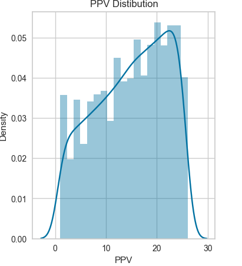
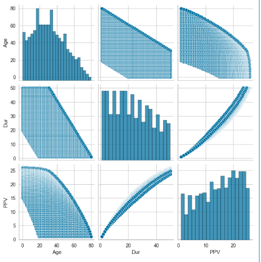
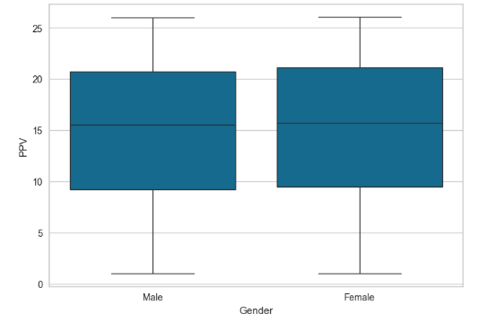
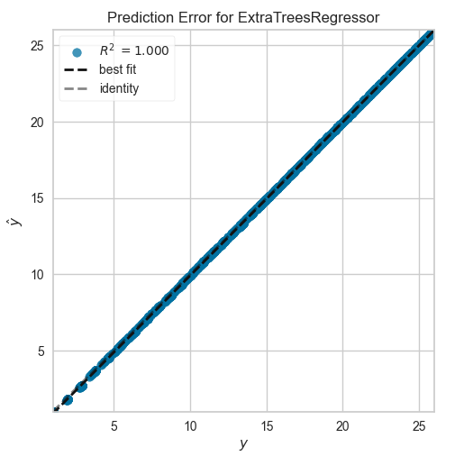

# Regression Model Analysis with PyCaret
## Introduction
This project presents the process of building and evaluating a regression model using the PyCaret library

In `Pycarte` module we have the following ML techniques:
- Regression
- Classification
- Clustering
- Anomaly Detection
#### What is the best for us based on our dataset?
since we want to predict PPV which is continuous we will use the Regression algorithms


## Project Structure

The notebook consists of the following key steps:


### 1. Model Setup and Training
   #### Model Setup:-
Setup function prepare dataset for training and testing, this function handles the missing values and encoding categorical variables

```python
regression_setup = setup(df, target='PPV', session_id=123,
                         categorical_features=['Gender'],
                         numeric_features=['Age', 'Dur'],
                         normalize=True)
```
#### Model Training:-
Compares multiple regression models on the dataset and selects the one with the best performance.
```python
best_model = compare_models()
best_model

```
### 2. Model Evaluation
Evaluates the best model using PyCaret’s built-in tools and cross-validation.
```python
evaluate_model(best_model)
```
Predicts values for the target variable on the testing set and calculates performance metrics RMSE and MAE.
```python
predictions = predict_model(best_model)
```
### 3. Final Model Training
training the best model on the entire dataset to make it read for deployment
```python
final_model = finalize_model(best_model)
```
---
### 4. Model Saving & Loading

``` python
save_model(final_model,'final_model')
model =load_model('final_model')
```

## Model Evaluation
### Evaluating the model using RMSE and MAE

```python
from sklearn.metrics import mean_squared_error, mean_absolute_error

y_pred = predictions['prediction_label']
y_true = df['PPV'].loc[y_pred.index.tolist()]

rmse = mean_squared_error(y_true, y_pred, squared=False)
mae = mean_absolute_error(y_true, y_pred)

print(f"RMSE: {rmse}")
print(f"MAE: {mae}")
```

## Running Code
### Prerequisites:-
Ensure installing the following libraries:- 
- pandas        
- pycaret
- numpy
- scikit-learn
- openpyxl
- seaborn
- matplotlib
```bash
pip install pandas numpy pycaret scikit-learn openpyxl seaborn matplotlib
```
### Setup and Execution
1. Place the dataset file `TG_T_CashValues_Rel.xlsx` in the directory of the notebook.
2. Open the Jupyter Notebook and execute the cells in order.

---
## Dataset 
Source: `TG_T_CashValues_Rel.xlsx`.

Columns:
- `Gender`: Categorical variable.
- `Age`, `Dur`: Numeric Features.
- `PPV`: Target variable 
### Dataset Visualization
#### 1- `PPV` Distribution



#### 2-`Dataset` pair plot


#### 3- `Gender` box plot



---
## Model Justification 
### Extra Trees Regressor
This model was the best selected model by `PyCaret`, It provided excellent accuracy and robustness.
#### Performance metrics:-
| MAE                      | MSE    | RMSE   | R²    | RMSLE  | MAPE   |
|--------------------------|--------|--------|-------|--------|--------|
| 0.0067                   | 0.0003 | 0.0163 | 1.0000| 0.0012 | 0.0005 |
|

---
#### Prediction ERROR Plot

#### Why Extra Trees Regressor?
1- it can handle complex datasets with multiple features.

2- it prevents overfitting by randomization and robust ensemble techniques.


## Outputs
```
RMSE: 0.01633967406140317
MAE: 0.0067407144813240675
```
## Resources 
- [Pycarte Documentation](https://pycaret.gitbook.io/docs/get-started/modules)
- [Microsoft's AI Machine Learning Algorithm Cheat Sheet](https://learn.microsoft.com/en-us/azure/machine-learning/algorithm-cheat-sheet?view=azureml-api-1&WT.mc_id=docs-article-lazzeri#download-machine-learning-algorithm-cheat-sheet)
- [Scikit-learn Extra Trees Regressor](https://scikit-learn.org/stable/modules/generated/sklearn.ensemble.ExtraTreesRegressor.html)
## Screenshots


## Authors

- [Jad Atout](https://www.github.com/Jad-Atout)
- [Razan Hamad](https://github.com/razan0r)
- [Anwaar Abulola](https://github.com/Anwar974)

